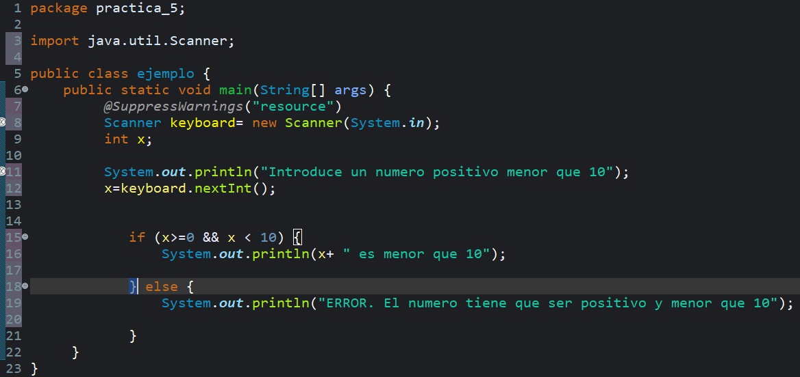
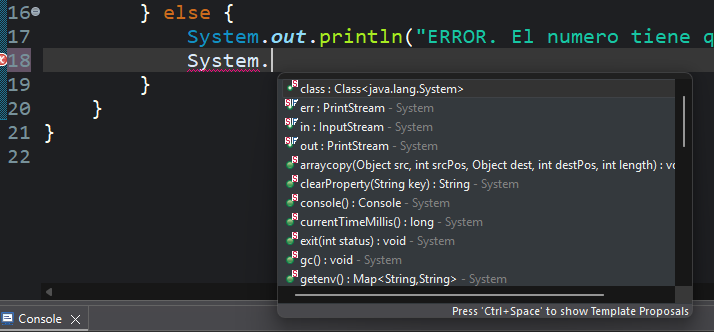
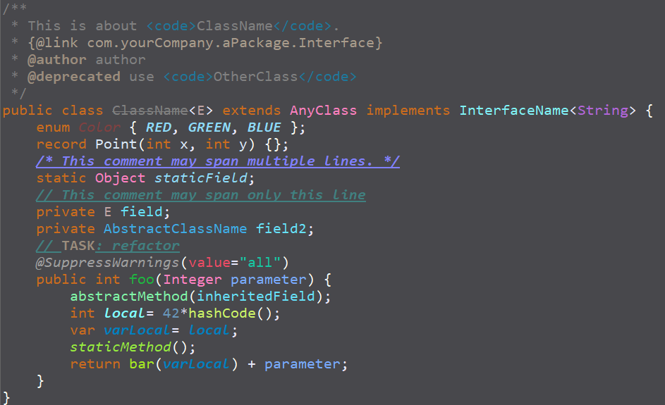
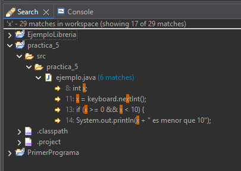
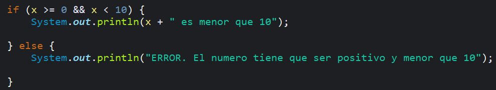
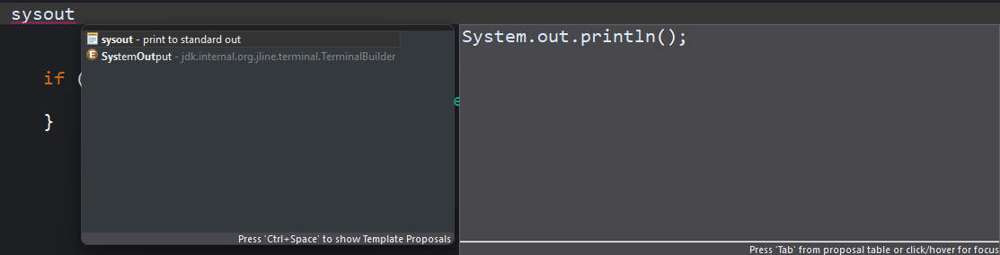

# PR-Eclipse-03-PreferenciasEditor

## 1. Opciones generales
La opción **Matching brackets** resalta la llave contraria a la que selecciones (si seleccionas la llave de apertura resalta la llave de cierre y viceversa) para saber donde empieza y termina un bloque de codigo. Es muy úitl en codigos grandes donde hay varios bloques de codigo anidados y quieres saber donde empieza y termina uno en concreto.

## 2. Save actions
La opcion **Format Source Code** te organiza las tabulaciones del código para que este ordenado y la opcion **Organize Imports** elimina los imports que no se esten usando. Ambas se ejecutan automáticamente al guardar. 

*Antes de guardar*

.png)

*Despues de guardar*

.png)

## 3. Content assist
Al estar a 0 la ventana de ayuda del autocompletado aparece instantáneamente despues de poner el punto, si modificas el valor tarda más en aparecer haciendo el trabajo más lento, por eso lo mejor es tenerlo en 0 para poder mejorar la productividad.

## 4. Syntax coloring
Esta función consiste en cambiar los colores de las distintas partes que componen el código. Es mejor no modificarlo y dejarlo por defecto por que puede afectar a la legibilidad, lo que es muy importante por que a la hora de leerlo se tiene que poder leer fácil y hay que poder distinguir bien las partes que componen el código.

## 5. Mark ocurrences
Esta opción viene activada por defecto, al seleccionar una palabra con un solo clic te la resalta en todo el código y hace mucho más fácil y rápido el buscar cierta palabra, si la desactivas tendrías que usar la vista Search y es bastante más lento y menos claro.

## 6. Typing
La opción **Auto Close** viene activada por defecto por que es muy útil para evitar errores de escritura ya que si no está activada tendrías que estar pendiente de cerrar las llaves, paréntesis, etc y en algún despiste se puede olvidar. 

## 7. Templates
Las plantillas son lineas o bloques de código prehechos que se suelen repetir mucho en un código y que tienen una palabra clave corta, al escribirla y pulsar ctrl + 7 aparece una ventana de ayuda seleccionas la opción que te haga falta y dandole al enter se escribe solo. Es muy útil para ahorrar tiempo y hacer el trabajo más fácil y rápido.

## ¿Cuál es más útil?
Todas me parecen muy útiles, pero las que me parecen más útiles son la opción de **auto close** de Typing y las plantillas de código. Son opciones que hacen mucho más fácil el trabajo.  
